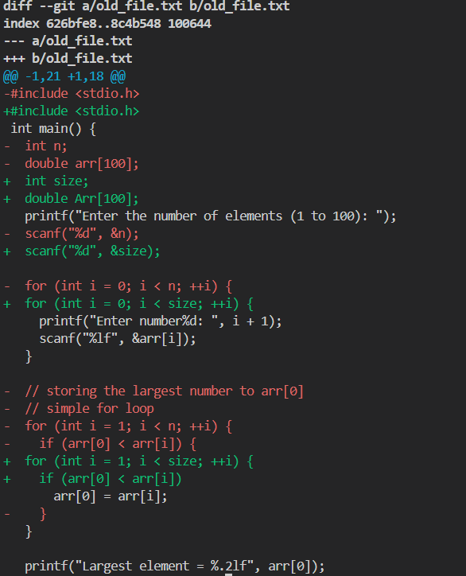
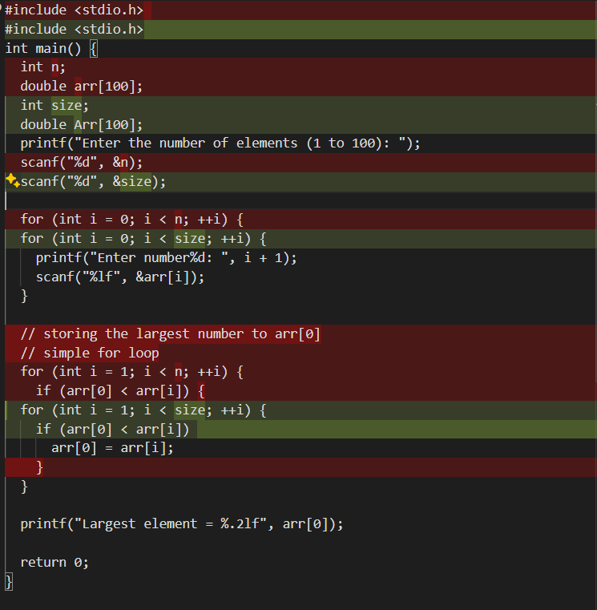
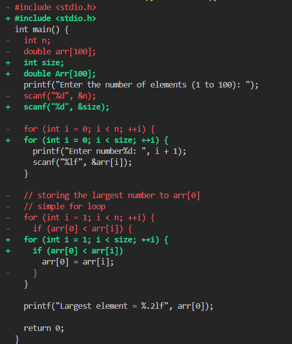
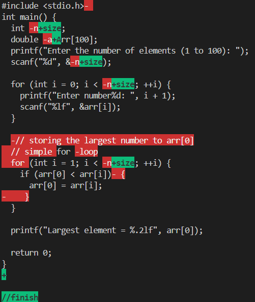

## diff.py

## diff2.py

## diff from git diff attached 

- git diff does not print the whole file, only the changes portion
- does not display that i have deleted a space
- does display if a space is added

## vs code extension

- vs code goes even further, shows the change in each line

## diff.py

- uses LCS to find Longest matching code, line by line, and then print diff.
- other notes in the file

### my output

## diff2.py

- applied the same logic of LCS to each character in the modified lines to get what is modified.

### my output
